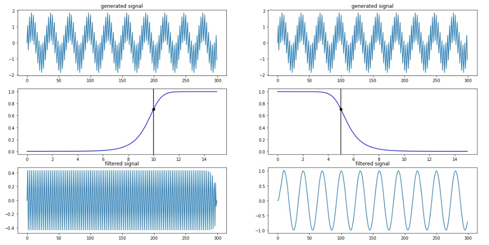

# نوسانات عصبی
نوسان عصبی یا موج مغزی، الگوهای ریتمیک یا تکراری فعالیت عصبی در سیستم عصبی مرکزی هستند. بافت عصبی می‌تواند فعالیت‌های نوسانی را به طرق مختلف به وجود آورد، که به وسیله مکانیسم درون نورون‌های فردی یا با تعامل بین نورون‌ها هدایت می‌شود. در نورون‌های فردی، نوسانات ممکن است به عنوان نوسان در پتانسیل غشا یا به عنوان الگوهای ریتمیک پتانسیل‌های عمل عمل کنند، که پس از آن موجب فعال شدن نوسانات نورون‌ها می‌شود. در سطح گروه‌های عصبی، فعالیت هماهنگ با تعداد زیادی از نورون‌ها می‌تواند به نوسانات ماکروسکوپی منجر شود که می‌تواند در الکتروانسفالوگرام مشاهده شود. فعالیت‌های نوسان در گروه‌های نورونی به‌طور کلی از ارتباطات بازخورد بین نورون‌ها ناشی می‌شود که منجر به هماهنگ سازی الگوهای شلیک آن‌ها می‌شود. تعامل بین نورون‌ها می‌تواند باعث افزایش نوسانات در فرکانس‌های مختلف نسبت به فرکانس شلیک نورون‌های فردی شود. یک مثال شناخته شده از نوسانات مغناطیسی عصبی فعالیت آلفا است. نوسان‌های عصبی توسط محققان در اوایل سال ۱۹۲۴ (توسط هانس برگر) مشاهده شد. بیش از ۵۰ سال بعد، رفتار نوسانی ذاتی در عصب‌های ستون مهره داران رخ داد، اما نقش عملکردی آن هنوز کاملاً درک نشده‌است.[۱] نقش احتمالی نوسان‌های عصبی شامل اتصال ویژگی، مکانیزم انتقال اطلاعات است. در دهه‌های گذشته، فهم این موضوع به دلیل پیشرفت در تصویربرداری مغز، بیشتر شده‌است. محدوده اصلی تحقیق در علوم اعصاب شامل تعیین اینکه چگونه نوسانات تولید می‌شوند و نقش آن‌ها می‌باشد. فعالیت‌های نوسان در مغز به‌طور گسترده‌ای در سطوح مختلف سازمان بندی می‌شود و به نظر می‌رسد نقش مهمی در پردازش اطلاعات عصبی داشته باشد.

## تاریخچه
ریچارد کاتون فعالیت الکتریکی را در نیمکره مغزی خرگوش و میمون کشف کرد و یافته‌هایش را در سال ۱۸۷۵ منتشر کرد.[۲] آدولف بک در سال ۱۸۹۰، مشاهدات خود را از فعالیت الکتریکی خودبخودی مغز خرگوش و سگ منتشر کرد که شامل نوسان‌های ریتمیک که توسط نور تغییر یافته و به وسیله الکترودهای سطح مغز تشخیص داده شده بود.[۳] قبل از هانس برگر، ولادیمیر ولدیمویوویچ اولین EEG حیوانات و توانایی تحریک شده از یک سگ را منتشر کرد.[۴]

## بررسی اجمالی
نوسانات عصبی در سراسر سیستم عصبی مرکزی و در تمام سطوح، و شامل، پتانسیل میدان محلی و در مقیاس بزرگ نوسانات که می‌تواند توسط اندازه‌گیری‌های کامپیوتری (EEG)اندازه‌گیری شود. به‌طور کلی، نوسانات را می‌توان با فرکانس، دامنه و فاز آن‌ها مشخص کرد. این خواص سیگنال می‌تواند از ضبط‌های عصبی با استفاده از تجزیه و تحلیل فرکانس زمان استخراج شود. در نوسانات وسیع، تغییرات دامنه ای به دلیل تغییرات در هماهنگ سازی در یک گروه عصبی در نظر گرفته می‌شود که به عنوان هماهنگ سازی محلی نامیده می‌شوند. علاوه بر هماهنگ سازی محلی، فعالیت نوسانی ساختارهای عصبی (تک سلولی یا گروه‌های عصبی) هماهنگ می‌شوند. نوسانات عصبی و هماهنگ سازی با بسیاری از توابع شناختی مانند انتقال اطلاعات، ادراک، کنترل موتور و حافظه مرتبط است.

## نمونه کد
``` python
import tensorflow as tf
import numpy as np
import matplotlib.pyplot as plt
```


## نمونه تصویر


## نمونه فرمول
$$
\operatorname{ker} f=\{g\in G:f(g)=e_{H}\}{\mbox{.}}
$$


$$
\frac{dv}{dt}= I_{syn}
$$